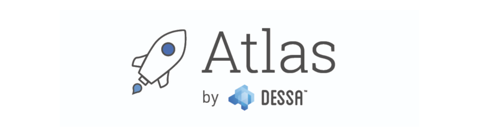
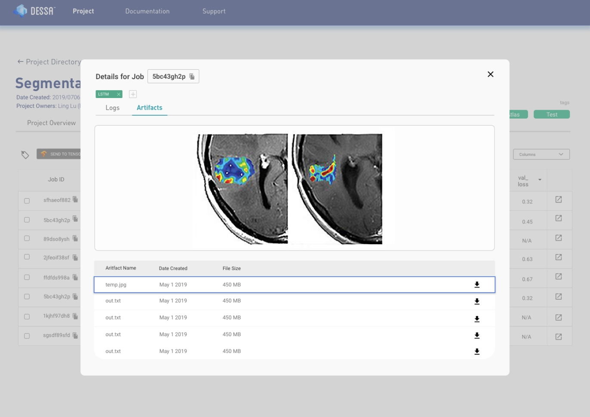
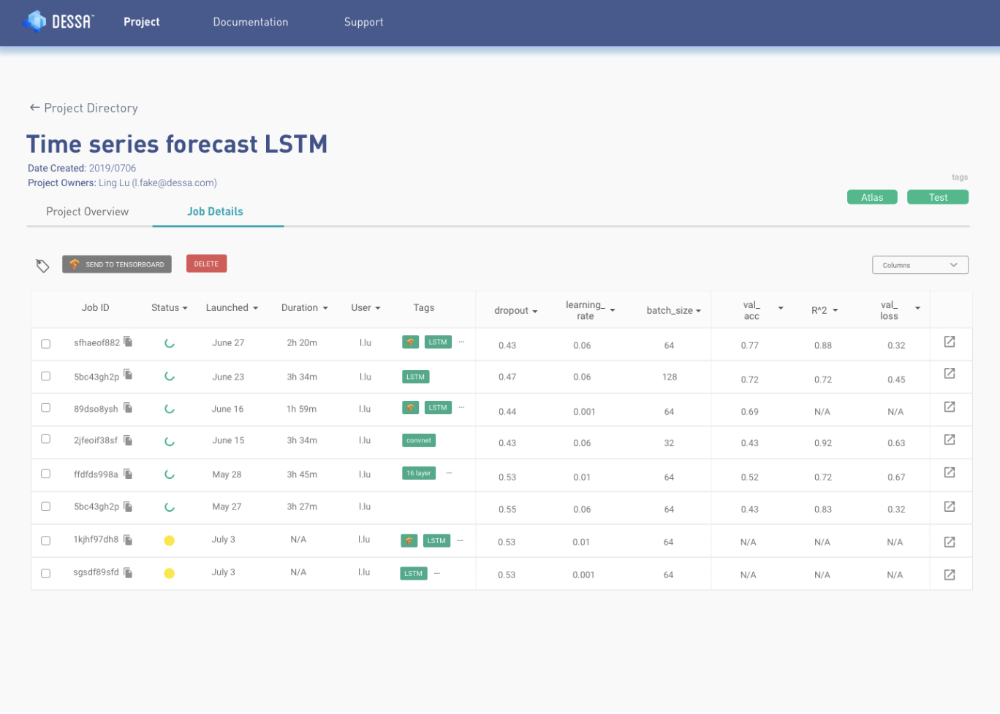

#  Foundations Atlas Tutorial
<p align="center">
  
</p>


# What is Atlas?

Atlas was built by our machine learning engineers to dramatically reduce the model development time, from the experimentation workflow to production.

Here are some of the core features:

**1. Experiment Management & Tracking:**

Tag experiments and easily track hyperparameters, metrics, and artifacts such as images, GIFs, and audio clips in a web-based GUI to track the performance of your models

**2. Job queuing & scheduling:**

Launch and queue thousands of experiment variations to fully utilize your system resources

**3. Collaboration & Bookkeeping:**

Keep a journal of thoughts, ideas, and comments on projects

**4. Reproducibility:**

Maintain an audit trail of every single experiment you run, complete with code and any saved items

<p float="left">
  
   
</p>

# Start Guide

**Prerequisites**

1. Docker version >18.09 (Docker installation: [Mac](https://docs.docker.com/docker-for-mac/install/) | [Windows](https://docs.docker.com/docker-for-windows/install/))
2. Python >3.6 ([Anaconda installation](https://www.anaconda.com/distribution/))
3. \>5GB of free machine storage
4. The atlas_ce_installer.py file (Download after signup [here](https://www.atlas.dessa.com/))


**Steps**

See [Atlas documentation](https://dessa-atlas-community-docs.readthedocs-hosted.com/en/latest/ce-quickstart-guide/). 

<details>
  <summary>FAQ: How to upgrade an older version of Atlas?</summary>
<br>

1. Stop atlas server using `atlas-server stop`
2. Remove docker images related to Atlas in your terminal `docker images | grep atlas-ce | awk '{print $3}' | xargs docker rmi -f`
3. Remove the environment where you installed the Atlas or pip uninstall the Atlas `conda env remove -n your_env_name`

-------------------------------------------------------------------------------------------------------------------------
</details>

# Image Segmentation

This tutorial demonstrates how to make use of the features of Foundations Atlas. Note that **any machine learning job can be run in Atlas without modification.** However, with minimal changes to the code we can take advantage of Atlas features that will enable us to:

* view artifacts such as plots and tensorboard logs, alongside model performance metrics
* launch many training jobs at once
* organize model experiments more systematically


## Data and Problem

The dataset that will be used for this tutorial is the [Oxford-IIIT Pet Dataset](https://www.robots.ox.ac.uk/~vgg/data/pets/), created by Parkhi *et al*. The dataset consists of images, their corresponding labels, and pixel-wise masks. The masks are basically labels for each pixel. Each pixel is given one of three categories :

* Class 1 : Pixel belonging to the pet.
* Class 2 : Pixel bordering the pet.
* Class 3 : None of the above/ Surrounding pixel.

Download the processed data [here](https://dl-shareable.s3.amazonaws.com/train_data.npz').


## Clone the Tutorial

Clone this repository and make it your current directory by running:
```bash
git clone https://github.com/dessa-public/Image-segmentation-tutorial.git
```

## Start Atlas

Activate the conda environment in which Foundations Atlas is installed. Then run `atlas-server start` in a new tab terminal. Validate that the GUI has been started by accessing it at [http://localhost:5555/projects]().


## Enabling Atlas Features

You are provided with the following python scripts:

main.py: A main script which prepares data, trains an U-net model, then evaluates the model on the test set.

To enable Atlas features, we only to need to make a few changes. Firstly add the following line to the top of main.py:

```python
import foundations
```

## Logging Metrics and Parameters

## Saving Artifacts

## TensorBoard Integration 

## Configuration

* To run a single job with Atlas, type the following in the terminal:
```python
foundations submit scheduler . main.py
```
Make sure your current directory is `Image-segmentation-tutorial`.

* To run multiple experiments, run:
```python
python hyperparameter_search.py
```

