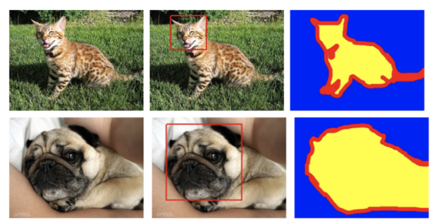

#  Foundations Atlas Tutorial
<p align="center">
  
</p>


# Start Guide

**Prerequisites**

1. Docker version >18.09 (Docker installation: <a target="_blank" href="https://docs.docker.com/docker-for-mac/install/"> Mac</a>
 | <a target="_blank" href="https://docs.docker.com/docker-for-windows/install/"> Windows</a>)
2. Python >3.6 (<a target="_blank" href="https://www.anaconda.com/distribution/">Anaconda installation</a>)
3. \>5GB of free machine storage
4. The atlas_ce_installer.py file (sign up and <a target="_blank" href="https://www.atlas.dessa.com/"> DOWNLOAD HERE </a>)


**Steps**

See <a target="_blank" href="https://dessa-atlas-community-docs.readthedocs-hosted.com/en/latest/ce-quickstart-guide/">Atlas documentation</a>
  

<details>
  <summary>FAQ: How to upgrade an older version of Atlas?</summary>
<br>

1. Stop atlas server using `atlas-server stop`
2. Remove docker images related to Atlas in your terminal `docker images | grep atlas-ce | awk '{print $3}' | xargs docker rmi -f`
3. Remove the environment where you installed the Atlas or pip uninstall the Atlas `conda env remove -n your_env_name`

-------------------------------------------------------------------------------------------------------------------------
</details>

# Image Segmentation

This tutorial demonstrates how to make use of the features of Foundations Atlas. Note that **any machine learning job can be run in Atlas without modification.** However, with minimal changes to the code we can take advantage of Atlas features that will enable us to:

* view artifacts such as plots and tensorboard logs, alongside model performance metrics
* launch many training jobs at once
* organize model experiments more systematically


## Data and Problem

The dataset that will be used for this tutorial is the <a target="_blank" href="https://www.robots.ox.ac.uk/~vgg/data/pets/">Oxford-IIIT Pet Dataset</a>, created by Parkhi *et al*. The dataset consists of images, their corresponding labels, and pixel-wise masks. The masks are basically labels for each pixel. Each pixel is given one of three categories :

* Class 1 : Pixel belonging to the pet.
* Class 2 : Pixel bordering the pet.
* Class 3 : None of the above/ Surrounding pixel.

Download the processed data [here](https://dl-shareable.s3.amazonaws.com/train_data.npz).

Paste the downloaded file named `train_data.npz` under the `data` directory of Image-segmentation-tutorial project.



## U-Net Model

The model being used here is a modified U-Net. A U-Net consists of an encoder (downsampler) and decoder (upsampler). In-order to learn robust features, and reduce the number of trainable parameters, a pretrained model can be used as the encoder. Thus, the encoder for this task will be a pretrained MobileNetV2 model, whose intermediate outputs will be used, and the decoder will be the upsample block already implemented in TensorFlow Examples in the [Pix2pix](https://github.com/tensorflow/examples/blob/master/tensorflow_examples/models/pix2pix/pix2pix.py) tutorial.
 
The reason to output three channels is because there are three possible labels for each pixel. Think of this as multi-classification where each pixel is being classified into three classes.

As mentioned, the encoder will be a pretrained MobileNetV2 model which is prepared and ready to use in [tf.keras.applications](https://www.tensorflow.org/versions/r2.0/api_docs/python/tf/keras/applications). The encoder consists of specific outputs from intermediate layers in the model. Note that the encoder will not be trained during the training process.

In the following sections, we will describe how to use this repository and train your own image-segmentation ML model in just a few steps.
## Clone the Tutorial

Clone this repository by running:
```bash
git clone https://github.com/dessa-public/Image-segmentation-tutorial.git
```
and then type `cd Image-segmentation-tutorial` in the terminal to make this your current directory.

## Start Atlas

Activate the conda environment in which Foundations Atlas is installed (by running `conda activte your_env` inside terminal). Then run `atlas-server start` in a new tab terminal. Validate that the GUI has been started by accessing it at <a target="_blank" href="http://localhost:5555/projects">http://localhost:5555/projects</a>.

## Running a job

Activate the environment in which you have Foundations Atlas installed, then from inside the project directory (Image-segmentation-tutorial) run the following command:
```python
foundations submit scheduler . code/main.py
```
Notice that you didn't need to install any other packages to run your job because Foundations already take care of it.

Now you already have code reproducbility:
You can reproduce your code and results at any time later in the future. In order to recover the code corresponding to any Foundations Atlas job_id, just `cd ~/.foundations/job_data/archive/your_job_id_here/artifacts` where you can find the code corresponding to a job-id in order to reproduce your results. 

You can also check the logs of your job by clicking the expand button on the right end of the job row in the GUI where you can check the performance of this job by checking the logs.

Congrats! Your code is now tracked by Foundations Atlas! Let's move on to explore the magic of Atlas. 
## Full Atlas Features
The full Atlas features include: 
1. Automatic environment creation for jobs
1. Use of custom docker images to avoid replicating download of packages
1. Experiment tracking via GUI to monitor various jobs
1. Code reproducibility for different experiments
1. Automatic job scheduling which run in the background
1. Live logs for any running jobs and saved logs for finished or failed jobs
1. Hyperparameter search to create better ML models
1. Track job performance via job parameters and metrics
1. Save any objects such as images, audio, video corresponding to any job and view inside GUI
1. Tensorboard integration to analyze deep ML models


## How to Enable Full Atlas Features

Inside the `code` directory, you are provided with the following python scripts:

* main.py: a main script which prepares data, trains an U-net model, then evaluates the model on the test set.

To enable Atlas features, we only to need to make a few changes. To begin using foundations atlas, add an import statement to the beginning of `main.py`:

```python
import foundations
```

## Data Directory

It is always good practice to only package the code and not the data for every job. This is to prevent excessive usage of your computer's storage. 
```python
train_data = np.load('./data/train_data.npz', allow_pickle=True)
```
Replace the above block where the `train_data.npz` is loaded with the line below:
```python
train_data = np.load('/data/train_data.npz', allow_pickle=True)
```
More details of how it will work inside Foundations Atlas are provided under the `Configuration` section below in this document.

## Logging Metrics and Parameters

The last line of main.py outputs the training and validation accuracy. After these statements, we will call to the function `foundations.log_metric()`.This function takes two arguments, a key and a value. Once a job successfully completes, logged metrics for each job will be visible from the Foundations GUI. Copy the following line and replace the print statement with it.

```python
model.save("trained_model.h5")

# Add foundations log_metrics here
```

after above lines in `main.py` add:

```python
foundations.log_metric('train_accuracy', float(train_acc))
foundations.log_metric('val_accuracy', float(val_acc))

# track hyperparameters
foundations.log_params(hyper_params)

```

## Saving Artifacts

We have created graphs for test samples. With Atlas, we can save any artifact to the GUI with just one line. Add the following lines to send the locally saved plot to the Atlas GUI.
 ```python
    plt.savefig(f"sample_{name}.png")
 ``` 
 after the above line in `main.py`, add below line:
```python
foundations.save_artifact(f"sample_{name}.png", key=f"sample_{name}")
```
Moreover, you can save trained model by adding below

```python
foundations.save_artifact('trained_model.h5', key='trained_model')
```
to the end of `main.py`.

## TensorBoard Integration 


<a target="_blank" href="https://www.tensorflow.org/tensorboard/r1/summaries">TensorBoard</a> is a super powerful data visualization tool that makes visualizing your training extremely easy. Foundations Atlas has full TensorBoard integration. 

```python
# Add tensorboard dir for foundations here  i.e. foundations.set_tensorboard_logdir('tflogs')
```
After above line, to access TensorBoard directly from the Atlas GUI, add the following line of code:
```python
foundations.set_tensorboard_logdir('tflogs')
```

## (Optional) Build Docker Image

The motivation of building customized image is to avoid reinstalling packages listed in the requirements.txt repeatedly. Run the following command in the terminal:
```bash
cd custom_docker_image
docker build . --tag image_seg:atlas
```
By doing this, you have created a docker image named `image_seg:atlas` on your local computer that conatins the python environment required to run this job.


### Running with the Built Docker Image: Configuration

The configuration file should be created to specify additional settings for any Foundations Atlas job. 
Below is an example of configuration file that you can use for this project.

First, create a file named `job.config.yaml` inside `code` directory, and copy the text from below into the file. 

You can specify project name, docker images in this configuration. 

Benefit from last `Build Docker Image` option, you have already build `image_seg:atlas`. 


```python
# Project config #
project_name: 'Image-segmentation-tutorial'
log_level: INFO

# Worker config #
# Additional definition for the worker can be found here: https://docker-py.readthedocs.io/en/stable/containers.html

num_gpus: 0

worker:
  image: image_seg:atlas # name of your customized images
  volumes:
    /local/path/to/folder/containing/data:
      bind: /data/
      mode: rw
```

Note: If you don't want to use the custom docker image, you can just comment out or just delete the whole `image` line inside `worker` section of this config file shown above. In this case, Foundations Atlas will use a default docker image and will automatically create the required enviornment for the each job seperately (this may take relatively longer time if your job needs a lot of packages to be installed).

Make sure to give right path of your data folder as shown below:

Under the `volumes` section, you will need to replace `/local/path/to/folder/containing/data` with your local absolute path of data folder so that your data can be accessed within the Foundations Atlas docker container.

## Run with full features of foundations atlas

Go inside the `code`directory and run the command below in your terminal (make sure you are in the foundations enviornment).
```python
foundations submit scheduler . main.py
```
This time we are running the `main.py` from inside the `code` directory. In this way, Foundations Atlas will only package the `code` folder and the `data` folder will get mounted directly inside Foundations Atlas docker container (as we specified inside the configuration file above). In this way, the data will not be a part of job package making it much faster and memory efficient.

At any point, to clear the queue of submitted jobs:
```python
foundations clear-queue scheduler
```

## How to Improve the Accuracy?
After running your most recent job, you can see that the validation accuracy is not very impressive. 
The predicted artifacts don't look similar to the true masks either. 

### Debugging with Tensorboard
Let's analyze the gradients using Tensorboard to understand what is happening with this sub par model. 
First click on the checkbox for your most recent job and press `Send to Tensorboard` button. 
This should open a new tab with Tensorboard up and running. 
Find the [histograms](http://localhost:5959/#histograms) tab. 

There you will see gradient plots such as below, where the first upsample layer has a range of gradients between 0.4 and -0.4:

Final upsample layer       |   Previous layers | ..  | First upsample layer| 
:-------------------------:|:-------------------------:|:-------------------------:|:-------------------------:|
  |   |   |   

As it is apparent from the plots, the gradients for the first upsample layer are small and centered around zero.
To prevent vanishing of gradients in the earlier layers, you can try modifying the code appropriately. 
Feel free to check the hints within the code! Alternatively the correct solution can be found below.

Validation accuracy | Validation loss
:-------------------------:|:-------------------------:
 |  


### Solution
<details><summary>Click to See</summary>
<p>


Modern architectures often benefit from skip connections and appropriate activation functions to avoid the vanishing gradients problem.
Looking at the function `main.py/unet_model` reveals that the skip connections are not properly implemented. 
After the line `x = up(x)` add the below lines to fix this:
```
concat = tf.keras.layers.Concatenate()
x = concat([x, skip])
```

Another problem in the model is the usage of the sigmoid in the function `pix2pix.py/upsample`:
```
result.add(tf.keras.layers.Activation('sigmoid'))
```
Modify this line as below:
```
result.add(tf.keras.layers.ReLU())
```
Running another job with these changes results in a significantly higher accuracy, with below gradient plots, 
where the first upsample (`conv2d_transpose_4x4_to_8x8` under `grad_sequential`) layer has a range of gradients between 125 and -125 (300x greater now in magnitude!):

Final upsample layer       |   Previous layers | ..  | First upsample layer| 
:-------------------------:|:-------------------------:|:-------------------------:|:-------------------------:|
  |   |   |   

Validation accuracy | Validation loss
:-------------------------:|:-------------------------:
 | 

</p>
</details>


## Running a Hyperparameter Search

Atlas makes running multiple experiments and tracking the results of a set of hyperparameters easy. Create a new file called 'hyperparameter_search.py' inside the `code` directory and paste in the following code:

```python
import os
import numpy as np
import foundations

NUM_JOBS = 10

def generate_params():

    hyper_params = {'batch_size': int(np.random.choice([8, 16, 32, 64])),
                    'epochs': int(np.random.choice([10, 20, 30, 50])),
                    'learning_rate': np.random.choice([0.1, 0.01, 0.001, 0.0001]),
                    'decoder_neurons': [np.random.randint(16, 512), np.random.randint(16, 512),
                                        np.random.randint(16, 512), np.random.randint(16, 512)],
                    }
    return hyper_params


for job_ in range(NUM_JOBS):
    print(f"packaging job {job_}")
    hyper_params = generate_params()
    foundations.submit(scheduler_config='scheduler', job_dir='.', command='main.py', params=hyper_params,
                       stream_job_logs=False)
```

This script samples hyperparameters uniformly from pre-defined ranges, then submits jobs using those hyperparameters. For a script that exerts more control over the hyperparameter sampling, check the end of the tutorial. The job execution code is still coming from main.py; i.e. each experiment is submitted to and ran with the script.

In order to get this to work, a small modification needs to be made to main.py. In the code block where the hyperparameters are defined (indicated by the comment 'define hyperparameters'), we'll load the sampled hyperparameters instead of defining a fixed set of hyperparameters explictely.

```python
# define hyperparameters: Replace hyper_params by foundations.load_parameters()
hyper_params = {'batch_size': 16,
                'epochs': 10,
                'learning_rate': 0.0001,
                'decoder
```
Replace the above block with the following:
```python
hyper_params = foundations.load_parameters()
```

Now, to run the hyperparameter search, from the `code` directory simply run:
```bash
python hyperparameter_search.py
```

## Congrats!
That's it! You've completed the Foundations Atlas Tutorial. Now, you should be able to go to the <a target="_blank" href="http://localhost:5555/projects">GUI</a> and see your running and completed jobs, compare model hyperparameters and performance, as well as view artifacts and training visualizations on TensorBoard.

Do you have any thoughts or feedback for Foundations Atlas? Join the [Dessa Slack community](https://u12604448.ct.sendgrid.net/wf/click?upn=FWkFK8jQsWHHe3Zs0Gq5lTVfVJ15gKBcKJ8U8683-2FgbxDO0AKr58M46HvgnHq5gu7wxIxP578G4skYZ0QeDgMvlsnXObXuf729kfmWrTshGGl6TUN1-2FFyXqmyrD5ZoV-2FZRo0hnw3InKzQzFwqlF1quZt7VDueDH-2FEBH340YEI-2BzPVPIYVXfgn1PnGl8fkLCnbYCd3y-2FE9USkbXAlUUrS32M6lVOa8yh3Zx0NI6a4qqpVFMxksNDun1d3ARH2OSPbpz1vHZKPFnXOfLxXECu8PNhWW7f7-2FVoNinol6t-2BZkEIwfKAjbZI9cZRHYLkxGcq1fsHpXGYBb2nNHtUGC77Lo19RTjhUG7juCEF34X3kF4WvYGqy5xbhbLBL1VsCLH-2BckvPQvF-2Bungthb9Y9DVEIIY4DrphpWV2nxMH57ReudsB-2FoUEtHc18-2BSR84JprF1rfenfH4JeL2dr9DuunbkWvOph-2FkBza8U6YjdxtyfjjfJcoBacw-2B-2BmL6u6HWVn6M95UMOlfqzhF9cb-2FtspPAta5-2FN-2FXlygoZptG74-2B1qYgqeJKdfs8NNbZ21inPrj7an6r1nYNW4YC2xhFyLU2xQsBqtA-3D-3D_HUWHbgbBidglsEUmLbxZPG73zbI-2FXxUPQjCzMJWkdroEX4ThZ-2Ba-2FJdu8bhCG1wcvpbbfZo-2BiSSdhtu4tG6XMtkBL8Zae-2BGEwDN3szVNiE30Om1ynfKmNpOylsSRYgejDusVxPEBpP9-2FS7hlC9E8wo2TuFuHrlbl22LkB75K0wEtiJO0c2mViU1HaEmPEzBLCHXf0Y9-2BfRiS6YpAx89cMJwZ-2FMdDGn6VZ5J9E7sIA7uLAld9W8Xdng7daA-2B1UUesrCZrB378tYyV8RbFvAnAvAn08hSekPk-2B-2BE6Anb5HnHs8XDTwPMX7sPvViiOeXxCyHWzYDvS-2FTwddaZaPC2CL8lnQwdSWGGaDm1qQRQMv8W5CeeQbMj4Y4afLIpw6ujHEv9wrMcqEQ8WLNT0YmT8mXDJ-2FdsCQq8geKsHq4T8tWttr00sD8cyI7bWpNHnj05w2jgR0MVnuB3iWDUw-2F8P3yPB2-2BxfA34jXuxFn-2B30bf-2FOnkNcu-2B-2B0UeWmzxmjZyvxCXpjPvurewqGr-2Fpcx78JUfAHaFKyRorhoDV8yvd85XK-2BJ6vyGuwZ1wrEDBJTsE-2BGedJ)!


## References
1. https://www.tensorflow.org/tutorials/images/segmentation
1. https://dessa-atlas-community-docs.readthedocs-hosted.com/en/latest/